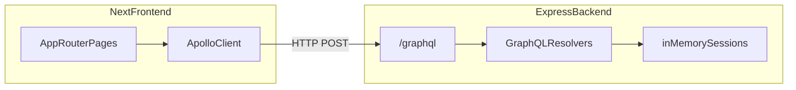

# Scrum Poker

Minimal full-stack planning poker for a technical assessment: Next.js (App Router) + Apollo Client on the frontend, Express + Apollo Server + GraphQL on the backend, **in-memory** session storage, **polling** for updates.

## Prerequisites

- Node.js 20+ (LTS recommended)
- npm

## Setup

From the repository root:

```bash
npm run install:all
```

Or install each package separately:

```bash
cd backend && npm install
cd ../frontend && npm install
```

### Environment

**Frontend** — optional; defaults to local GraphQL:

- `NEXT_PUBLIC_GRAPHQL_URL` — GraphQL HTTP endpoint (default: `http://localhost:4000/graphql`)

Create `frontend/.env.local` if the API is not on the default URL:

```bash
echo 'NEXT_PUBLIC_GRAPHQL_URL=http://localhost:4000/graphql' > frontend/.env.local
```

**Backend** — optional:

- `PORT` — server port (default: `4000`)
- `FRONTEND_ORIGIN` — CORS allowlist, comma-separated (default: `http://localhost:3000`)

## Run

Two terminals:

```bash
# Terminal 1 — API
cd backend && npm run dev

# Terminal 2 — Web
cd frontend && npm run dev
```

- App: [http://localhost:3000](http://localhost:3000)
- GraphQL: [http://localhost:4000/graphql](http://localhost:4000/graphql)

## Usage flow

1. **Create session** — enter your name; you are redirected to `/session/[id]?playerId=[hostId]` (host).
2. **Join session** — another browser/profile: enter name + session id from the host’s URL.
3. **Vote** — pick a card (`1`, `2`, `3`, `5`, `8`, `13`, `?`). Until reveal, the UI shows only **Voted / Waiting**, not values.
4. **Reveal** — when **every** player has voted, the **host** sees **Reveal votes**; the backend rejects reveal until all votes are in.

## Architecture



- **Domain**: `Session` has `id`, `hostId`, `revealed`, `players[]`; each `Player` has `id`, `name`, optional `vote`.
- **Backend**: single module [`backend/src/index.ts`](backend/src/index.ts) wires Express + Apollo; schema in [`backend/src/schema/typeDefs.ts`](backend/src/schema/typeDefs.ts), logic in [`backend/src/schema/resolvers.ts`](backend/src/schema/resolvers.ts), store in [`backend/src/store/sessions.ts`](backend/src/store/sessions.ts).
- **Frontend**: Apollo Provider in [`frontend/src/app/ApolloWrapper.tsx`](frontend/src/app/ApolloWrapper.tsx); operations in [`frontend/src/graphql/`](frontend/src/graphql/); session screen polls with `pollInterval: 2000` in [`frontend/src/app/session/[id]/SessionRoom.tsx`](frontend/src/app/session/[id]/SessionRoom.tsx).

## Design decisions and tradeoffs

| Decision | Why |
|----------|-----|
| **In-memory store** | Fast to build and review; fine for an assessment. Data is lost on restart; no migrations or DB ops. |
| **Polling instead of subscriptions** | Simpler ops and debugging; no WebSocket infra. Acceptable for a tiny room and a demo. |
| **No auth** | Out of scope; `playerId` is passed in the URL after create/join (demo-only, not secure). |
| **Thin layers** | Resolvers map closely to mutations/queries; no heavy framework on the backend so the GraphQL surface stays obvious. |
| **Vote secrecy** | The UI hides values until reveal; the wire payload still includes votes (no field-level redaction). Production apps would mask server-side or use authenticated viewers. |

## What would improve with more time

- Subscriptions or SSE for instant updates instead of 2s polling  
- Server-side masking of `vote` until reveal + explicit `hasVoted` in schema  
- Persistence (Redis/Postgres) and basic reconnect/session recovery  
- Host authorization on `revealVotes`, rate limits, input validation  
- Docker Compose for one-command dev  
- **Reset round** / multiple stories, clearer GraphQL errors for clients  

## Scripts (root)

| Script | Purpose |
|--------|---------|
| `npm run install:all` | Install root + backend + frontend dependencies |
| `npm run dev:backend` | Run backend dev server |
| `npm run dev:frontend` | Run Next.js dev server |
| `npm run build:backend` | Compile backend TypeScript |
| `npm run build:frontend` | Production build for frontend |

## Production builds

```bash
cd backend && npm run build && npm start
cd frontend && npm run build && npm start
```
