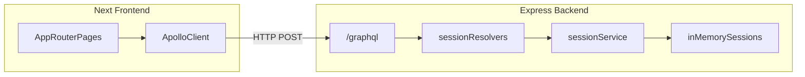

# Technology choices

This document explains **architecture**, **stack**, and **tradeoffs** for this assessment-sized Scrum Poker app.

For **how to install and run** the project, see [README.md](README.md).

## Stack overview

- **Frontend:** Next.js (App Router), React, TypeScript, Apollo Client, Tailwind CSS  
- **Backend:** Node.js, Express, Apollo Server, GraphQL, TypeScript  
- **Data:** in-memory only (no database)  
- **Live updates:** GraphQL queries + polling

## Architecture

### Domain and layout

**Session model.** A `Session` has `id`, `hostId`, `revealed`, `players`, and `history` (always present; starts empty). Each `Player` has `id`, `name`, and optional `vote`. When a round completes, one **RoundHistory** row is appended: `round`, ISO `createdAt`, and `votes[]` snapshots `{ playerId, playerName, vote }` taken at reveal time so past rows stay stable if players join later or names change elsewhere.

**Where things live**

| Area | Role |
|------|------|
| `backend/src/index.ts` | Express + Apollo bootstrap |
| `backend/src/schema/` | GraphQL SDL (`typeDefs`) and resolvers |
| `backend/src/services/sessionService.ts` | Vote flow, reset, history append |
| `backend/src/store/` | In-memory sessions + guards |
| `backend/src/types/RoundHistory.ts` | History snapshot types |
| `frontend/src/providers/AppProviders.tsx` | Apollo Client + i18n for the tree |
| `frontend/src/components/session/` | Session room UI (`GuessHistory`, etc.) |
| `frontend/src/graphql/` | Operations (session query polls every 2s) |
| `frontend/src/i18n/locales/` | EN / NL strings |

### Guess history

When the **last** vote in a round causes everyone to have voted, `revealed` flips to `true` and **one** history row is appended (`history` is always present on `Session`, initially empty). The inner `if (!session.revealed)` guard in `vote()` ensures we do not append duplicates if a client sends extra votes while already revealed. **`resetVotes`** clears current votes and `revealed` but **does not** trim `history`. History is **not** aggregated (no averages); it is a literal list of per-player votes per finished round.

### Apollo Provider

`ApolloProvider` comes from `@apollo/client`. It puts a single **Apollo Client** instance into React context so any nested component can call `useQuery`, `useMutation`, etc. That client owns the GraphQL **cache**, **network layer**, **polling**, and **loading/error** state—without prop-drilling a client instance through the tree. It is composed together with `**I18nProvider`** in `[AppProviders.tsx](frontend/src/providers/AppProviders.tsx)`.

### GraphQL schema location

The schema is a `**#graphql` string** in `[typeDefs.ts](backend/src/schema/typeDefs.ts)` next to Apollo bootstrap—no separate `.graphql` file or copy step in `npm run build`, to keep deployment simple for a small repo.

### CORS (`FRONTEND_ORIGIN`)

Environment variables are a single string; the `[cors](https://github.com/expressjs/cors)` package expects `origin` as a string or **array** of allowed origins. We `**split` on commas** so one value works (`http://localhost:3000` → one-element array), and you can allow multiple origins (e.g. localhost + LAN URL).

### IDs

- **Session (room) codes:** short 6-character alphanumeric strings (easy to share).  
- **Player IDs:** UUIDs, distinct from room codes.

### Docker

[`docker-compose.yml`](docker-compose.yml) builds both images with repository root as [`docker build context`](https://docs.docker.com/build/building/context) so [`tsconfig.base.json`](tsconfig.base.json) is available to [`backend/tsconfig.json`](backend/tsconfig.json) and [`frontend/tsconfig.json`](frontend/tsconfig.json)

- **Backend:** [`backend/Dockerfile`](backend/Dockerfile) — `npm ci`, TypeScript compile to `dist/`, then `npm prune --omit=dev`; listens on **4000**.
- **Frontend:** [`frontend/Dockerfile`](frontend/Dockerfile) — follows the **multi-stage layout from the Next.js Docker docs** (deps → build with standalone → non-root `node` runner).

**Why `NEXT_PUBLIC_GRAPHQL_URL` uses `http://localhost:4000/graphql`:** GraphQL runs in the **browser**. It must use an URL reachable from the client machine—typically the host-published API port—not the internal Compose hostname (`backend`).

## Design decisions and tradeoffs

| Decision                               | Why                                                                                                                          |
| -------------------------------------- | ---------------------------------------------------------------------------------------------------------------------------- |
| **In-memory store**                    | Faster to build. Data is lost on restart, no migrations or DB.                                                               |
| **Polling instead of websocket**       | Simpler operations and debugging. No time to implement websocket + subscriptions.                                            |
| **No auth**                            | Out of scope. Not required for small planning poker application.                                                             |
| **Short session codes + UUID players** | Room id stays easy to share; each player gets a UUID so they are not confused with game codes and collisions are negligible. |
| **Vote secrecy**                       | The UI hides values until reveal, the wire payload still includes votes (no field-level redaction).                          |
| **Guess history in memory**            | Simple to ship; same lifecycle as sessions—lost on API restart unless persisted elsewhere.                                   |

## What would improve with more time

- Subscriptions or server sent events for instant updates instead of 2s polling  
- Server-side masking of `vote` until reveal + explicit `hasVoted` in schema  
- Persistence (Redis/Postgres) and basic reconnect/session recovery  
- Rate limits, richer validation, structured GraphQL errors  
- Production-hardened Docker (healthchecks, non-root users, image scanning)  
- Better error handling  
- Authentication  
